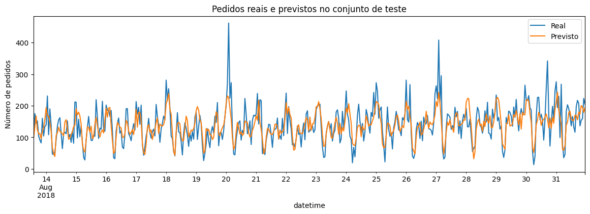

# Táxis | Previsão de demanda por hora

**Sprint 13 · Ciência de Dados · TripleTen**

Previsão de séries temporais com atributos de calendário, defasagens e validação cronológica.

[Voltar ao portfólio](../../README.md) · [Guia de reprodução](../../docs/REPRODUCAO.md)

## Problema de negócio

Prever os pedidos de táxi da próxima hora para apoiar o dimensionamento de motoristas em aeroportos.

## Método

1. Reamostragem dos pedidos em intervalos de uma hora e análise de tendência e sazonalidade.
2. Criação de 72 defasagens e média móvel de 168 horas com deslocamento para não incluir o alvo.
3. Busca de hiperparâmetros com TimeSeriesSplit e reserva dos 10% finais para teste.
4. Comparação com média constante e previsão ingênua da hora anterior.

## Resultados

| Modelo ou referência | RMSE no teste |
|---|---:|
| **LightGBM** | **39,07** |
| Random Forest | 40,58 |
| Regressão linear | 41,99 |
| Árvore de decisão | 47,54 |
| Valor da hora anterior | 58,86 |
| Média do treinamento | 83,98 |

O resultado do LightGBM ficou abaixo do limite de 48 pedidos definido no exercício.

**Origem das métricas:** Saídas das células 33 e 35 de `sprint13.ipynb` (índices começando em zero). Os números são históricos, preservados nos arquivos recebidos; os modelos não foram retreinados na preparação deste portfólio.

## Interpretação

O LightGBM foi escolhido pela validação temporal e superou as duas referências no teste. O diagnóstico visual mostra que os picos de demanda ainda tendem a ser subestimados.

## Visualização



*Gráfico extraído da saída já salva no notebook.*

## Arquivos

- [sprint13.ipynb](sprint13.ipynb)

## Como executar

Abra um terminal nesta pasta e use um ambiente Python compatível com as dependências do projeto:

```bash
python -m venv .venv
```

Ative com `.venv\Scripts\activate.bat` no Prompt de Comando do Windows ou `source .venv/bin/activate` no Linux/macOS. Em seguida:

```bash
python -m pip install -r requirements.txt
python -m jupyterlab
```

Os dados originais **não acompanham o repositório**. Obtenha-os no material do curso, se tiver acesso, e coloque os seguintes itens em `data/`:

- `taxi.csv`

Na célula de leitura, substitua `/datasets/taxi.csv` por `data/taxi.csv`.

Depois de configurar os caminhos, execute as células na ordem. Para apenas ler os resultados, abra o notebook no GitHub, sem instalar dependências.

## Limitações e próximos passos

- O período analisado vai de março a agosto de 2018; não há validação para um ciclo anual completo.
- A avaliação é de um passo à frente e pressupõe acesso às observações anteriores; não equivale a prever várias horas sem novos dados.
- A oferta efetiva de motoristas e a redução do tempo de espera não foram medidas.

## Tecnologias

Python, Jupyter e numpy, pandas, matplotlib, scikit-learn, lightgbm, statsmodels.

## Contexto

Projeto educacional desenvolvido por **Lucas Maia Orenga** durante a formação em Ciência de Dados da TripleTen. Enunciados, marcas e dados dos estudos de caso pertencem aos respectivos titulares. O notebook original foi preservado, incluindo comentários, saídas e referências do curso.
