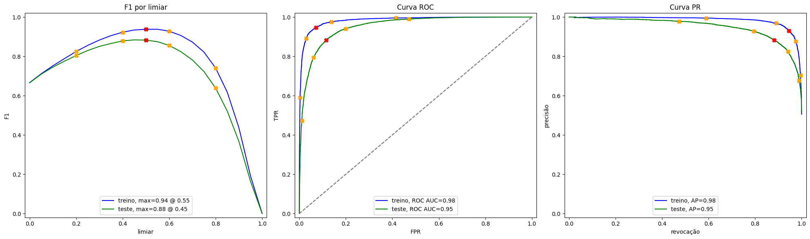

# Film Junky Union | Análise de sentimentos

**Sprint 14 · Ciência de Dados · TripleTen**

Classificação de resenhas em inglês com TF-IDF e comparação entre modelos lineares e boosting.

[Voltar ao portfólio](../../README.md) · [Guia de reprodução](../../docs/REPRODUCAO.md)

## Problema de negócio

Identificar automaticamente a polaridade de resenhas de filmes, com meta de F1 de pelo menos 0,85.

## Método

1. Exploração da base e preparação dos textos, respeitando a divisão de treino e teste fornecida.
2. Normalização, remoção de stopwords e vetorização TF-IDF.
3. Comparação de regressão logística, lematização com spaCy e LightGBM.
4. Discussão dos limites em resenhas curtas, negação e textos em outro idioma.

## Resultados

| Evidência disponível | F1 no teste |
|---|---:|
| TF-IDF + regressão logística: saída salva, arredondada | **0,88** |
| TF-IDF + regressão logística: valor informado na conclusão | 0,883 |
| spaCy + TF-IDF + regressão logística: conclusão | 0,879 |
| spaCy + TF-IDF + LightGBM: conclusão | 0,868 |

A saída salva sustenta F1 de aproximadamente 0,88 para a regressão logística. A tabela final e a avaliação do LightGBM não têm saída persistida; os valores de três casas acima vêm do texto da conclusão.

**Origem das métricas:** Saídas das células 38 e 45 e texto da célula 64 de `sprint14.ipynb` (índices começando em zero). Os números são históricos, preservados nos arquivos recebidos; os modelos não foram retreinados na preparação deste portfólio.

## Interpretação

A conclusão do estudo recomenda TF-IDF com regressão logística, combinando boa qualidade com uma solução simples. A comparação completa pode ser refeita com os dados originais.

## Visualização



*Gráfico extraído da saída já salva no notebook.*

## Arquivos

- [sprint14.ipynb](sprint14.ipynb)

## Como executar

Abra um terminal nesta pasta e use um ambiente Python compatível com as dependências do projeto:

```bash
python -m venv .venv
```

Ative com `.venv\Scripts\activate.bat` no Prompt de Comando do Windows ou `source .venv/bin/activate` no Linux/macOS. Em seguida:

```bash
python -m pip install -r requirements.txt
python -m jupyterlab
```

Os dados originais **não acompanham o repositório**. Obtenha-os no material do curso, se tiver acesso, e coloque os seguintes itens em `data/`:

- `imdb_reviews.tsv`

Altere a variável `caminho` para `data/imdb_reviews.tsv`. Execute também `python -m spacy download en_core_web_sm`; o notebook baixa as stopwords do NLTK. A lematização grava um cache local.

Depois de configurar os caminhos, execute as células na ordem. Para apenas ler os resultados, abra o notebook no GitHub, sem instalar dependências.

## Limitações e próximos passos

- O vocabulário foi aprendido em inglês; a solução não foi treinada para português.
- Células da parte final não têm resultados salvos. As conclusões correspondentes ainda precisam de uma execução completa para reconfirmação.
- Resenhas curtas, ironia e negações exigem avaliação específica; oito exemplos manuais não representam um teste externo abrangente.

## Tecnologias

Python, Jupyter e numpy, pandas, matplotlib, seaborn, scikit-learn, lightgbm, nltk, spacy, tqdm.

## Contexto

Projeto educacional desenvolvido por **Lucas Maia Orenga** durante a formação em Ciência de Dados da TripleTen. Enunciados, marcas e dados dos estudos de caso pertencem aos respectivos titulares. O notebook original foi preservado, incluindo comentários, saídas e referências do curso.
