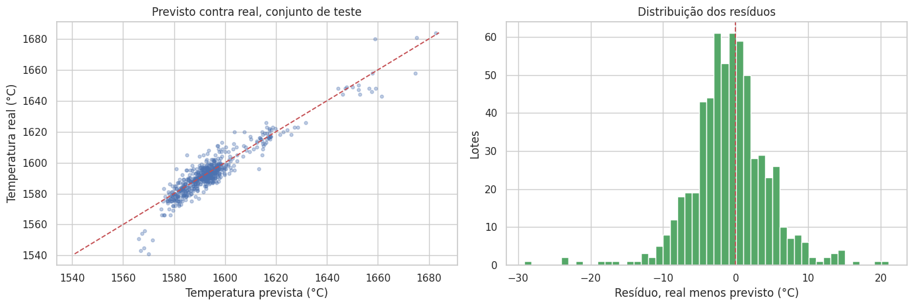

# Steelproof | Previsão da temperatura do aço

**Sprint 17 · Ciência de Dados · TripleTen**

Modelagem industrial com integração de sete fontes, recorte temporal de atributos e tradução dos resultados para a operação.

[Voltar ao portfólio](../../README.md) · [Guia de reprodução](../../docs/REPRODUCAO.md)

## Problema de negócio

Apoiar a decisão de aquecimento no refino em panela, estimando a temperatura final do aço a partir das informações disponíveis entre iterações do processo.

## Método

1. Integração de sete tabelas por lote e tratamento de medições inválidas.
2. Construção de atributos somente até a penúltima medição; exclusão do gás da base oficial por falta de horário.
3. Comparação de regressão linear, Random Forest, LightGBM e CatBoost com validação temporal.
4. Otimização de hiperparâmetros, comparação com baselines e diagnóstico dos erros por faixa de temperatura.

## Resultados

| Indicador | Resultado registrado |
|---|---:|
| MAE do CatBoost no teste | **3,91 °C** |
| MAE da referência: repetir a última leitura disponível | 5,07 °C |
| Redução do MAE em relação à referência | **22,92%** |
| RMSE no teste | 5,40 °C |
| R² no teste | 0,880 |
| Diferença relativa entre erro de treino e teste, conforme cálculo do notebook | 9,95% |
| Lotes no teste | 618 |

**Origem das métricas:** Saídas das células 60, 62 e 76 de `Sprint17_2.ipynb` (índices começando em zero). Os números são históricos, preservados nos arquivos recebidos; os modelos não foram retreinados na preparação deste portfólio.

## Interpretação

O CatBoost apresentou erro menor que a regra operacional simples e diferença entre treino e teste dentro do critério estabelecido. A recomendação do estudo é um piloto assistido para apoiar o operador. A economia de energia discutida na apresentação é uma estimativa de cenário, ainda sem validação operacional.

## Visualização



*Gráfico extraído da saída já salva no notebook.*

## Arquivos

- [Sprint17_1.ipynb](Sprint17_1.ipynb)
- [Sprint17_2.ipynb](Sprint17_2.ipynb)
- [Sprint17_3.pptx](Sprint17_3.pptx)

## Como executar

Abra um terminal nesta pasta e use um ambiente Python compatível com as dependências do projeto:

```bash
python -m venv .venv
```

Ative com `.venv\Scripts\activate.bat` no Prompt de Comando do Windows ou `source .venv/bin/activate` no Linux/macOS. Em seguida:

```bash
python -m pip install -r requirements.txt
python -m jupyterlab
```

Os dados originais **não acompanham o repositório**. Obtenha-os no material do curso, se tiver acesso, e coloque os seguintes itens em `data/`:

- `data_arc_en.csv`
- `data_bulk_en.csv`
- `data_bulk_time_en.csv`
- `data_gas_en.csv`
- `data_temp_en.csv`
- `data_wire_en.csv`
- `data_wire_time_en.csv`

No planejamento, ajuste `CAMINHOS` para incluir `./data/`. Na solução, altere `PASTA` para `./data/`. Abra primeiro `Sprint17_1.ipynb` e depois `Sprint17_2.ipynb`. A apresentação resume o caso para uma audiência de negócio.

Depois de configurar os caminhos, execute as células na ordem. Para apenas ler os resultados, abra o notebook no GitHub, sem instalar dependências.

## Limitações e próximos passos

- A previsão pressupõe uma medição recente e uso entre iterações; não foi validada para antes do primeiro aquecimento.
- A base cobre 94 dias. Faltam horários do gás, identificação dos materiais e tipo de aço.
- A redução do erro preditivo não comprova, por si só, economia de energia; esse efeito precisa ser medido em um piloto.

## Tecnologias

Python, Jupyter e numpy, pandas, matplotlib, seaborn, scikit-learn, lightgbm, catboost.

## Contexto

Projeto educacional desenvolvido por **Lucas Maia Orenga** durante a formação em Ciência de Dados da TripleTen. Enunciados, marcas e dados dos estudos de caso pertencem aos respectivos titulares. O notebook original foi preservado, incluindo comentários, saídas e referências do curso.
